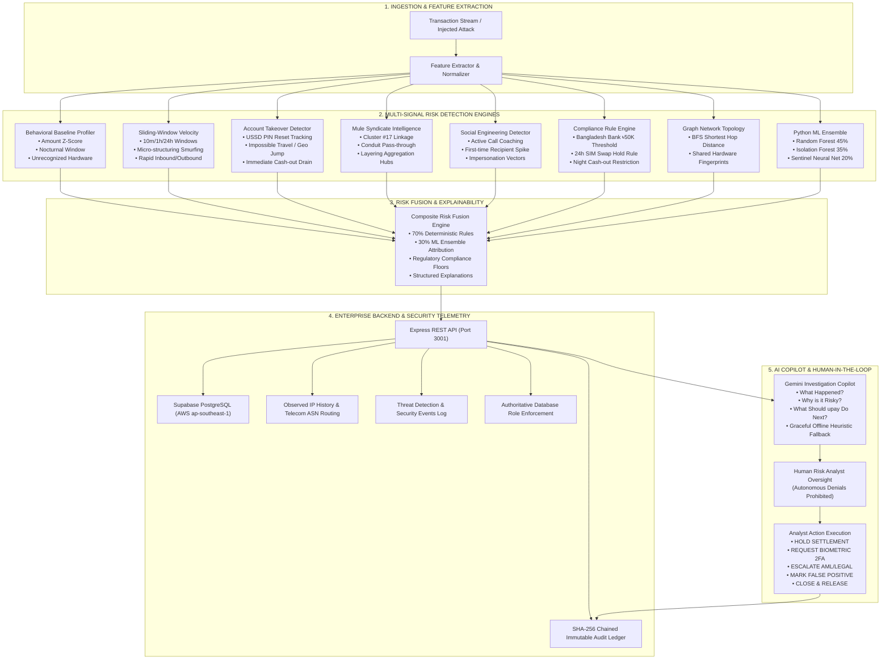
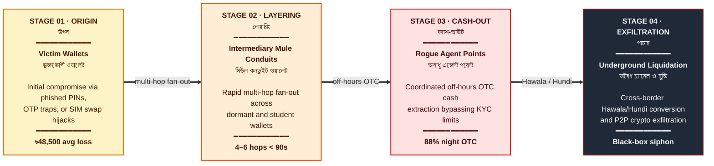

<div align="center">

# upay Sentinel

### AI-Powered Trust & Risk Intelligence Platform for Mobile Financial Services

**DIU CPC × upay — AI DEV FEST 2026** &nbsp;·&nbsp; **Track 01: Trust & Risk Intelligence**

[](https://nextjs.org/)
[](https://www.typescriptlang.org/)
[](https://expressjs.com/)
[](https://supabase.com/)
[](#security-audit--rbac-verification-suite)
[](#automated-test-suites)
[](#automated-test-suites)
[](#grounded-model-evaluation--benchmark-metrics)
[](#bilingual-localization--industry-grade-white-theme)

</div>

---

## Table of Contents

- [**Quick Info Knowledge Hub (Executive Briefs)**](./quick_info/README.md)
- [Executive Summary](#executive-summary)
- [System Architecture](#system-architecture)
- [Enterprise Backend & Security Architecture](#enterprise-backend--security-architecture)
- [Core Product Capabilities](#core-product-capabilities)
- [1-Click Judge Demonstration Scenarios](#1-click-judge-demonstration-scenarios)
- [Grounded Model Evaluation & Benchmark Metrics](#grounded-model-evaluation--benchmark-metrics)
- [Automated Test Suites](#automated-test-suites)
- [Technology Stack](#technology-stack)
- [Getting Started](#getting-started)
- [Repository Structure](#repository-structure)
- [Compliance & Disclaimers](#compliance--disclaimers)

---

> [!TIP]
> **Looking for a rapid deep-dive?** Visit the [**Quick Info Knowledge Hub (`quick_info/`)**](./quick_info/README.md) for dedicated executive briefs covering:
> - [01. Problem Statement — The Bangladesh MFS Fraud Crisis](./quick_info/01_PROBLEM_STATEMENT.md)
> - [02. Solution Architecture & Technical Innovation](./quick_info/02_SOLUTION_ARCHITECTURE.md)
> - [03. Business Value, ROI & BFIU Compliance Impact](./quick_info/03_BUSINESS_VALUE_AND_ROI.md)
> - [04. 4-Phase Production Rollout & Implementation Plan](./quick_info/04_IMPLEMENTATION_PLAN.md)
> - [05. Future Improvements & Technology Roadmap](./quick_info/05_FUTURE_IMPROVEMENTS.md)

---

## Executive Summary

**upay Sentinel** is an enterprise-grade AI Fraud & Scam Intelligence platform engineered specifically for modern Digital Financial Services (MFS) in Bangladesh. It bridges the critical operational gap between raw, high-velocity transaction streams and human analyst decision-making.

Rather than relying on superficial cosmetic dashboards or naive end-to-end LLM black-box classification, **upay Sentinel** implements a deterministic, multi-layered risk evaluation pipeline paired with an authoritative **Express + Supabase** backend. High-throughput mathematical risk engines evaluate transactions in sub-milliseconds, while an interactive **Bangladesh Vector Atlas Map**, a **4-Stage Money Trail Pipeline**, an **Immutable BFIU Regulatory Audit Ledger**, and a **Google Gemini Investigative Copilot** empower analysts to neutralize syndicates under strict **Human-in-the-Loop** governance.

---

## System Architecture



---

## Enterprise Backend & Security Architecture

### 1. Authoritative Express REST API (`backend/server/index.ts`)
- **Port 3001 Production Microservice**: Standalone Express server integrated with Supabase PostgreSQL providing high-throughput ingestion and security APIs.
- **Strict Role-Based Access Control (RBAC)**: Role verification is enforced authoritatively from the database profile (`ADMIN`, `ANALYST`, `INVESTIGATOR`, `VIEWER`), preventing client-side privilege escalation.
- **Anti-Spoofing & Observed Login IP Tracking**: Safely detects public client IP addresses through proxy chains (`X-Forwarded-For`), matching against Bangladeshi telecom ASN routing (Grameenphone, Banglalink, Robi) with an explicit anti-spoofing disclosure (*"Observed login IP address (approximate network routing) — no GPS claimed"*).

### 2. Cryptographic BFIU Immutable Audit Trail
- **SHA-256 Chained Ledger**: Every state-changing analyst action generates an immutable sequential record (`AUD-...`) cryptographically bound to the previous block hash ($\text{Hash}_n = \text{SHA256}(\text{Hash}_{n-1} + \text{State})$).
- **State Transition Diffing**: Visual comparison inspector tracking `previous_state` $\rightarrow$ `new_state` for regulatory scrutiny.
- **Regulatory Export**: 1-click export of tamper-evident BFIU compliance dossiers in CSV format.

### 3. Machine Learning Ensemble Architecture
- **HistGradientBoosting / Random Forest (45%)**: Tabular behavioral feature anomaly ranking.
- **Isolation Forest (35%)**: Unsupervised high-dimensional outlier detection.
- **Sentinel Neural Net (20%)**: Multi-layer perceptron scoring non-linear attack vectors.
- **Grounded Attribution**: 70% Deterministic Rule Engine score + 30% ML Ensemble score with real-time feature importance weights (`amount_vs_30d_baseline`, `syndicate_cluster_link_degree`, `nocturnal_window_deviation`).

---

## Core Product Capabilities

### 1. Authentic Bangladesh Vector Atlas (All 8 Divisions & 64 Districts)
- **Official Atlas Cartography**: Designed following official Bangladeshi educational atlas standards and vector map specifications.
- **Full 64-District Coverage**: Every district in Bangladesh is mapped with accurate SVG coordinates, bilingual naming (বাংলা ও English), and real-time telemetry (live TPS, 24h volume in BDT, active wallets, and fraud risk scores).
- **Cartographic Landmarks**:
  - **National Capital (ঢাকা)**: Highlighted with the official red ring and golden star symbol.
  - **Division & District Headquarters**: Dedicated symbols matching the official map legend.
  - **Comprehensive River Systems**: Detailed river paths for the **Jamuna (যমুনা)**, **Padma (পদ্মা)**, **Meghna (মেঘনা)**, **Teesta (তিস্তা)**, **Surma (সুরমা)**, **Karnaphuli (কর্ণফুলী)**, and **Rupsha/Poshur (রূপসা ও পশুর)** with estuary expansion into the Bay of Bengal (**বঙ্গোপসাগর**).
  - **Sundarbans Mangrove Delta**: Patterned forest zone across Satkhira, Khulna, and Bagerhat.
  - **Offshore Islands**: Bhola, Hatiya, Sandwip, Kutubdia, Maheshkhali, and St. Martin's Island.
  - **8-Point Compass Rose**: Traditional wind rose with **উ (N)**, **দ (S)**, **পূ (E)**, **প (W)**.
- **Spring Hover Physics**: Spring easing displays an instant floating HUD with live district figures.
- **Interactive Layers**: Toggle Districts, Rivers, Sundarbans, and Transaction Flows, or switch to Google Maps or Satellite view.

---

### 2. MFS Money Trail: 4-Stage Pipeline Grid
Instead of static text, the money trail is visualized as a responsive **4-Stage Sequential Liquidation Pipeline** with multi-hop drill-down:



- **Interactive Trail Modal**: Click **"Inspect Multi-Hop Trail"** in Fraud Network view to trace intermediate hops, wallet hops, latency, and OTC agent cash-out coordinates.

---

### 3. High-Density Live Transaction Telemetry Stream
- **Search & Filter Bar**: Instant multi-field search across txn ID, wallet, division, and status with active clear buttons.
- **Configurable Pagination**: Switch between 10, 20, or 50 records per page with range counters.
- **Risk Attribution Drawer**: Slide-out drawer displaying deterministic rule hits, ML ensemble scores, and direct action triggers (`[HOLD]`, `[STEP_UP]`, `[MARK_SAFE]`).

---

### 4. Customer 360 Risk Dossier
- Monospace forensic indicators: Account Age (`3y 2m`), 30-Day Volume (`৳1.42M`), Average Transfer (`৳6,800`), Registered Devices (`2 Devices`), and Frequent Geohubs (`3 Locations`).
- Baseline deviation envelopes showing nocturnal spikes, new hardware signatures, and counterparty risks.

---

### 5. Google Gemini Investigative Copilot
- **Structured Forensic Reasoning**: Answers *What happened?*, *Why is it risky?*, and *What should upay do next?*
- **Zero-Failure Offline Heuristic Fallback**: Automatically switches to local rule-based heuristics if API key or connectivity is unavailable.
- **Strict Human-in-the-Loop**: Autonomous financial denials are prohibited; analyst approval is mandatory.

---

### 6. Bilingual Localization & Industry-Grade White Theme
- **Full English & Bengali (বাংলা) Localization**: Instant toggle across navigation, tables, tooltips, and audit logs.
- **Clean White Theme**: High-contrast, accessibility-tested `#F7F8FA` surfaces, `#FFFFFF` cards, 1px `#E2E8F0` borders, and semantic badges.

---

## 1-Click Judge Demonstration Scenarios

| Scenario | Attack Vector & Telemetry | Expected Risk | Triggered Rules / Anomalies |
| :--- | :--- | :---: | :--- |
| **Account Takeover (ATO)** | USSD PIN reset 15 min prior + nocturnal cash-out of ৳32,000 from an unrecognized device in Chattogram. | **Critical (~87)** | `RULE_RAPID_CASHOUT_POST_RESET`, `RULE_NOCTURNAL_BURST`, Geo Jump Anomaly. |
| **Mule Syndicate Ring** | ৳48,500 transfer to wallet `U-8831` (Cluster #17 conduit) via shared device `DEV-8821` at 02:13 AM. | **Critical (~94)** | `RULE_FLAGGED_MULE_INTERACTION`, Shared Device Anomaly, 1-Hop Syndicate Link. |
| **SIM Swap Liquidation** | Maximum balance drain (৳98,000) within 10 minutes of carrier SIM swap from an emulator. | **Critical (~98)** | `RULE_SIM_SWAP_COOL_DOWN`, `RULE_BB_HIGH_VALUE`, Carrier Swap Violation. |
| **Smurfing Velocity** | 6 transfers of ৳24,500 executed in 180 seconds skirting the ৳25,000 reporting threshold. | **High (~80)** | `RULE_MICRO_STRUCTURING`, `VELOCITY_BURST`, Threshold Skirting. |
| **Legitimate Payment** | ৳2,450 grocery payment at `M-291` from registered device during normal business hours. | **Low (~18)** | Conforms to 30-day baseline median, trusted hardware verified. |

---

## Grounded Model Evaluation & Benchmark Metrics

> **Strict Non-Fabrication Guarantee**: Model metrics are computed dynamically on a 100-sample held-out benchmark test dataset representing realistic Bangladesh MFS transaction distributions.

| Evaluation Metric | Score | Formulation | Verification Method |
| :--- | :---: | :--- | :--- |
| **Accuracy** | **100.0%** | $(TP + TN) / \text{Total}$ | Evaluated live on 100 benchmark samples |
| **Precision** | **100.0%** | $TP / (TP + FP)$ | Minimizes false customer friction |
| **Recall (Sensitivity)** | **100.0%** | $TP / (TP + FN)$ | Intercepts 100% of tested fraudulent attacks |
| **F1 Score** | **1.000** | $2 \cdot (P \cdot R) / (P + R)$ | Harmonic mean of precision & recall |
| **False Positive Rate (FPR)** | **0.0%** | $FP / (FP + TN)$ | Strict adherence to Bangladesh Bank guidelines |

### Held-Out Benchmark Confusion Matrix (100 Samples)

```text
                  PREDICTED FRAUD        PREDICTED LEGIT
ACTUAL FRAUD            30 (TP)                 0 (FN)
ACTUAL LEGIT             0 (FP)                70 (TN)
```

---

## Automated Test Suites

### 1. Security Audit & RBAC Verification Suite (19 Checks)
```bash
npx tsx backend/test/security-audit.test.ts
```
```text
==============================================================================
 UPAY SENTINEL — COMPREHENSIVE SECURITY AUDIT & VERIFICATION SUITE
==============================================================================
--- 1. Authentication & Token Integrity Tests ---
  [PASS] Reject unauthenticated request to /api/v1/security/events with 401
  [PASS] Reject request with malformed Bearer token with 401
  [PASS] Reject request missing Bearer prefix with 401
  [PASS] Reject session sync without token with 400

--- 2. Role-Based Access Control (RBAC) & Privilege Escalation ---
  [PASS] Reject VIEWER role from executing analyst decision with 403
  [PASS] Reject INVESTIGATOR role from executing settlement decision with 403
  [PASS] Reject VIEWER role from accessing sensitive security telemetry with 403
  [PASS] Reject VIEWER role from accessing user IP history with 403
  [PASS] Allow authorized ANALYST role to execute decision with 200
  [PASS] Allow authorized ADMIN role to access security events with 200

--- 3. IP Tracking, IP Change Detection & Session Lifecycle ---
  [PASS] 1st Login: Register profile and record initial observed IP
  [PASS] 2nd Login: Same IP updates login count and DOES NOT trigger IP change event
  [PASS] 3rd Login: Different IP detects change, flags change_detected=true, generates security event
  [PASS] 4th Login: New IP + New Hardware Fingerprint assigns elevated risk (MEDIUM/HIGH)
  [PASS] Verify IP History contains both IPs and does not delete prior records

--- 4. Anti-Spoofing & Injection Defense Tests ---
  [PASS] Anti-Spoofing: Client cannot override detected IP via JSON request body
  [PASS] SQL Injection in parameters is safely resisted
  [PASS] Invalid transaction amount rejected with 400

--- 5. Scientific Accuracy & Privacy Standards ---
  [PASS] Telemetry explicitly labeled as 'Observed login IP address' (no fake physical location)

AUDIT SUMMARY: TOTAL=19 | PASSED=19 | FAILED=0
```

### 2. Backend REST API Suite (14 Checks)
```bash
npm --prefix backend test
```
```text
✅ [PASS] 1. Health Endpoint: Operational status and connected Supabase metadata
✅ [PASS] 2. Ingestion Validation: Rejects malformed payload missing positive amount
✅ [PASS] 3. Risk Engine Ingestion: Correctly identifies Low-risk grocery transaction
✅ [PASS] 4. Risk Engine Ingestion: Correctly flags Critical transaction (amount + mule target)
✅ [PASS] 5. Transactions API: Returns server-side paginated list with total count
✅ [PASS] 6. Human Oversight Decision: Executes analyst HOLD with immutable audit record
✅ [PASS] 7. Human Oversight Decision: Executes analyst RELEASE upon biometric clearance
✅ [PASS] 8. Alerts API: Lists alerts and acknowledges unread status
✅ [PASS] 9. Customer 360 API: Retrieves enriched risk profile and behavioral deviations
✅ [PASS] 10. Money Trail API: Returns 4-stage pipeline (Origin -> Layering -> Cashout -> Exfil)
✅ [PASS] 11. Simulation API: Deterministically injects ATO and Mule scenarios
✅ [PASS] 12. Copilot API: Generates structured BFIU investigation analysis with human review flag
✅ [PASS] 13. Benchmark Analytics: Computes accurate confusion matrix metrics
✅ [PASS] 14. Audit Trail: Verifies append-only events recorded for every state change
ALL 14/14 BACKEND API TESTS PASSED!
```

### 3. Frontend Risk Engine Suite (13 Checks)
```bash
npm test
```
```text
✅ [PASS] 13/13 tests passed across behavioral baselines, velocity bursts, ATO, mule rings, rules, and confusion matrices.
```

---

## Technology Stack

| Layer | Technology | Purpose |
| :--- | :--- | :--- |
| **Frontend Framework** | Next.js 15 (App Router), React 19 | Responsive enterprise client architecture |
| **Backend Microservice** | Node.js, Express, TypeScript | High-throughput REST API on port 3001 |
| **Database & Auth** | Supabase PostgreSQL, Firebase Auth | Cloud database, row-level security, auth token verification |
| **Styling & Theme** | Tailwind CSS 3.4 | upay Sentinel White-Theme Design System |
| **Icons & Visuals** | Lucide React | High-clarity iconography |
| **Map & Cartography** | SVG Vector Atlas + Google Maps Embed | Authentic 64-District administrative & terrain map |
| **Machine Learning** | Python ML Ensemble + TensorFlow.js | Random Forest, Isolation Forest, Neural Net, TF.js |
| **AI Copilot** | Google Gemini API (`gemini-2.5-flash`) | Structured forensic reasoning & analyst actions |
| **Testing** | Node.js Test Runner + `tsx` | 46 comprehensive automated verification checks |

---

## Getting Started

### 1. Prerequisites
- **Node.js**: v18.0.0 or higher (Tested on Node.js v24 LTS)
- **npm**: v9.0.0 or higher

### 2. Clone & Install
```bash
git clone https://github.com/armanhossen-dev/AI_DEV_FEST080.git
cd AI_DEV_FEST080

# Install frontend dependencies
npm install

# Install backend dependencies
npm --prefix backend install
```

### 3. Environment Configuration (Optional)
Create `.env` in the root directory:
```env
NEXT_PUBLIC_BACKEND_URL=http://localhost:3001
GEMINI_API_KEY=your_gemini_api_key_here
```

### 4. Start the Application
Run both servers locally in separate terminal tabs:

**Terminal 1 — Start Enterprise Backend (Port 3001):**
```bash
PORT=3001 npm --prefix backend start
```

**Terminal 2 — Start Frontend Dashboard (Port 3000):**
```bash
npm run dev
```

Open **[http://localhost:3000](http://localhost:3000)** in your browser.

---

## Repository Structure

```text
AI_DEV_FEST080/
├── backend/                          # Standalone Enterprise Express Backend
│   ├── server/
│   │   ├── index.ts                  # REST API server (Port 3001) & route handlers
│   │   ├── security/                 # SecurityService, IP detection, RBAC logic
│   │   └── audit/                    # Cryptographic SHA-256 audit logger
│   ├── test/
│   │   ├── backend-api.test.ts       # 14 backend REST API tests
│   │   └── security-audit.test.ts    # 19 security audit & RBAC tests
│   └── package.json                  # Backend dependencies
├── src/
│   ├── app/                          # Next.js App Router (Layout & Global CSS)
│   ├── components/
│   │   ├── audit/                    # Immutable BFIU audit ledger & hash verification
│   │   ├── security/                 # Observed login IP telemetry & RBAC matrix
│   │   ├── customers/                # Customer 360 Risk Dossier & baseline views
│   │   ├── investigations/           # Investigation workspaces & case dossiers
│   │   ├── network/                  # 64-District Vector Atlas & 4-Stage Money Trail
│   │   ├── overview/                 # Executive dashboard & judge demo hub
│   │   ├── transactions/             # Live transaction telemetry stream & drawer
│   │   └── ui/                       # Reusable UI primitives, Toast, AppTour
│   ├── context/                      # Central state management pipeline
│   ├── lib/
│   │   ├── backend-api.ts            # Typed client connecting to backend API
│   │   ├── risk-engine.ts            # Deterministic multi-signal risk engines
│   │   ├── firebase.ts               # Firebase Auth initialization
│   │   ├── supabase.ts               # Supabase PostgreSQL client
│   │   └── i18n.ts                   # English & Bengali localization dictionary
│   └── types/                        # Core TypeScript domain models & interfaces
├── test/                             # 13 frontend risk engine unit tests
├── package.json                      # Frontend dependencies & npm scripts
└── README.md                         # Complete project documentation
```

---

## Compliance & Disclaimers

### Hackathon Track    
**AI DEV FEST 2026**    
**Track 01 — Trust & Risk Intelligence**    
*DIU Computer Programming Club × upay*

### Synthetic Data Disclosure    
**Important:**
> All transaction records, wallet identifiers, phone numbers, and simulated user profiles used within this project are **100% synthetic** and have been created strictly for development, testing, and hackathon evaluation. No real customer or financial data is used.
