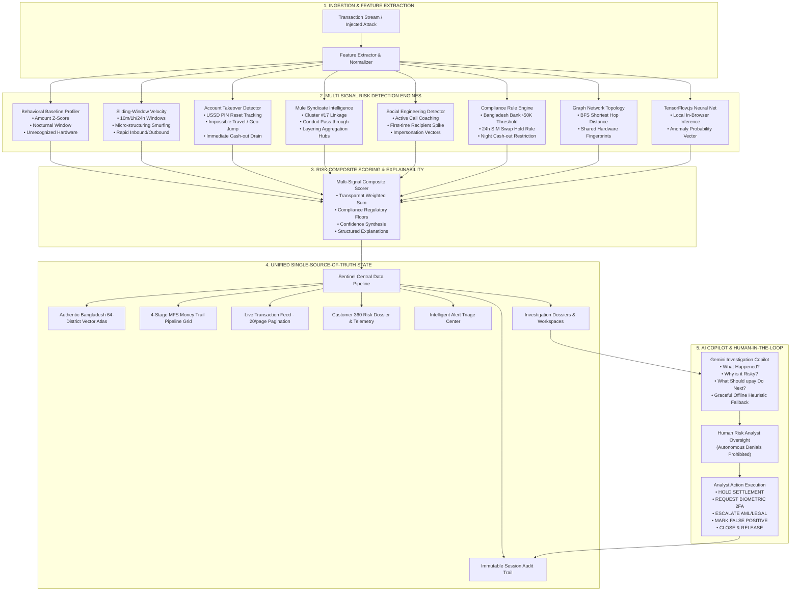
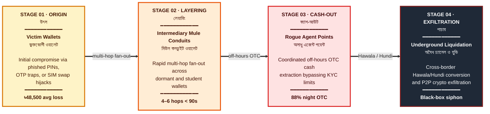

<div align="center">

# upay Sentinel

### AI-Powered Trust & Risk Intelligence Platform for Mobile Financial Services

**DIU CPC × upay — AI DEV FEST 2026** &nbsp;·&nbsp; **Track 01: Trust & Risk Intelligence**

[](https://nextjs.org/)
[](https://www.typescriptlang.org/)
[](https://tailwindcss.com/)
[](https://ai.google.dev/)
[](#4-run-automated-unit--benchmark-tests)
[](#grounded-model-evaluation--benchmark-metrics)
[](#6-bilingual-localization--enterprise-design-system)

</div>

---

## Table of Contents

- [Executive Summary](#executive-summary)
- [System Architecture](#system-architecture)
- [Core Product Capabilities](#core-product-capabilities)
- [1-Click Judge Demonstration Scenarios](#1-click-judge-demonstration-scenarios)
- [Grounded Model Evaluation & Benchmark Metrics](#grounded-model-evaluation--benchmark-metrics)
- [Technology Stack](#technology-stack)
- [Getting Started](#getting-started)
- [Repository Structure](#repository-structure)
- [Compliance & Disclaimers](#compliance--disclaimers)

---

## Executive Summary

**upay Sentinel** is an enterprise-grade AI Fraud & Scam Intelligence platform engineered specifically for modern Digital Financial Services (MFS) in Bangladesh. It bridges the critical operational gap between raw, high-velocity transaction streams and human analyst decision-making.

Rather than relying on superficial cosmetic dashboards or naive end-to-end LLM black-box classification, **upay Sentinel** implements a deterministic, multi-layered risk evaluation pipeline. High-throughput mathematical risk engines evaluate transactions in sub-milliseconds, while an interactive **Bangladesh Vector Atlas Map**, a **4-Stage Money Trail Pipeline**, and a **Google Gemini Investigative Copilot** empower analysts to neutralize syndicates under strict **Human-in-the-Loop** governance.

---

## System Architecture



---

## Core Product Capabilities

### 1. Authentic Bangladesh Vector Atlas (All 8 Divisions & 64 Districts)

- **Official Atlas Cartography**: Designed following official Bangladeshi educational atlas standards and vector map specifications.
- **Full 64-District Coverage**: Every district in Bangladesh is mapped with accurate SVG coordinates, bilingual naming (বাংলা ও English), and real-time telemetry (live TPS, 24h volume in BDT, active wallets, and fraud risk scores).
- **Cartographic Landmarks**:
  - **National Capital (ঢাকা)**: Highlighted with the official red ring and golden star symbol.
  - **Division & District Headquarters**: Dedicated symbols matching the official map legend.
  - **Comprehensive River Systems**: Detailed river paths for the **Jamuna (যমুনা)**, **Padma (পদ্মা)**, **Meghna (মেঘনা)**, **Teesta (তিস্তা)**, **Surma (সুরমা)**, **Karnaphuli (কর্ণফুলী)**, and **Rupsha/Poshur (রূপসা ও পশুর)** with estuary expansion into the Bay of Bengal (**ব ঙ্গো প সা গ র**).
  - **Sundarbans Mangrove Delta**: Patterned forest zone across Satkhira, Khulna, and Bagerhat.
  - **Offshore Islands**: Bhola (ভোলা), Hatiya (হাতিয়া), Sandwip (সন্দ্বীপ), Kutubdia (কুতুবদিয়া), Maheshkhali (মহেশখালী), and St. Martin's Island (সেন্ট মার্টিন).
  - **8-Point Compass Rose**: Traditional wind rose in the top-right corner with **উ (N)**, **দ (S)**, **পূ (E)**, **প (W)**.
  - **Surrounding Borders**: West Bengal, Meghalaya, Assam, Tripura, Mizoram, and Myanmar.
  - **Official Map Legend**: Clear keys for international borders, division boundaries, capital, HQs, and river networks.
- **Spring Hover Physics**: Hovering any division or district scales it up with smooth spring easing (`cubic-bezier(0.34, 1.56, 0.64, 1)`), displaying an instant floating HUD with live figures.
- **Interactive Search & Toggles**: Quick-search autocomplete for any of the 64 districts, one-click layer toggles (Districts, Rivers, Sundarbans, Transaction Flows), and seamless switching between **Colorful Atlas**, **Google Maps**, and **Satellite View**.

---

### 2. MFS Money Trail: 4-Stage Pipeline Grid

Instead of static descriptions, the money trail is visualized as a responsive **4-Stage Sequential Liquidation Pipeline** with directional connector arrows:



<sub>Risk intensity escalates left to right: from the initial compromise of a victim wallet, through mule layering and agent cash-out, to untraceable cross-border exfiltration.</sub>

---

### 3. High-Density Live Transaction Telemetry Stream

- **Search & Filter Bar**: Dedicated search box with clean icon alignment, border focus rings, and an instant clear button (`X`).
- **Configurable Pagination**: Defaulting to **20 records per page** (with instant `10 | 20 | 50` page-size switcher) and dynamic range counters (`Showing 1–20 of 48 records`).
- **Multi-Dimensional Filters**: Filter simultaneously by Risk Tier (Critical, High, Medium, Low), MFS Type (P2P Transfer, Cash Out, Merchant Pay, Add Money), and Division.
- **Live Stream Controls**: Pause and resume streaming in real-time, or trigger 1-click synthetic attack injections.

---

### 4. Customer 360 Risk Dossier

- **Prominent Risk Indicators**: Matching height and button sizing for the **`HIGH RISK PROFILE`** badge and the **`Open Case INV-1042 →`** action button.
- **Big & Bold Forensic Metrics**: High-contrast, large monospace figures for:

  | Account Age | 30d Volume | Avg Transfer | Known Devices | Known Hubs |
  | :---: | :---: | :---: | :---: | :---: |
  | `3y 2m` | `৳1.42M` | `৳6,800` | `2 Devices` | `3 Locations` |

- **Behavioral Baselines**: 90-day historical standard distribution envelopes contrasted against real-time anomalies (e.g., nocturnal burst transfers, device mismatches, rapid velocity spikes).

---

### 5. Google Gemini Investigative Copilot

- **Structured Forensic Reasoning**: Answers three critical questions for every flagged transaction:
  1. *What happened?* (Chronological transaction summary)
  2. *Why is it risky?* (Triggered compliance rules, baseline deviations, and syndicate graph linkages)
  3. *What should upay do next?* (Prescriptive operational recommendations)
- **Zero-Failure Offline Heuristic Fallback**: If the Gemini API key is not supplied or network connectivity is interrupted, the platform automatically engages its built-in rule-based heuristic synthesizer.
- **Human-in-the-Loop Safeguard**: Automated financial blocks are strictly prohibited; human analysts retain final authority to execute actions (`[HOLD]`, `[STEP_UP]`, `[ESCALATE]`, `[RELEASE]`).

---

### 6. Bilingual Localization & Enterprise Design System

- **Full Bilingual Support (EN / BN)**: One-click toggle between English and Bengali (**বাংলা**) across all views, data tables, map tooltips, and audit logs.
- **Enterprise Light Aesthetic**: Built on a clean `#F7F8FA` wash with crisp `#E4E7EC` borders, zero heavy drop shadows, and accessible WCAG 2.1 contrast ratios.
- **Auto-Dismiss Notifications**: Floating toast alerts feature a 10-second lifetime, visual progress countdown bar, hover-pause, and smooth fade-out animations.

---

## 1-Click Judge Demonstration Scenarios

To verify the platform end-to-end, open the **Overview Dashboard** and click any scenario in the **Judge Demo Hub**:

| Scenario | Attack Vector & Telemetry | Expected Risk | Triggered Rules / Anomalies |
| :--- | :--- | :---: | :--- |
| **Account Takeover (ATO)** | USSD PIN reset 15 min prior + nocturnal cash-out of ৳32,000 from an unrecognized device in Chattogram. | **Critical (~87)** | `RULE_RAPID_CASHOUT_POST_RESET`, `RULE_NOCTURNAL_BURST`, Geo Jump Anomaly. |
| **Mule Syndicate Ring** | ৳48,500 transfer to wallet `U-8831` (Cluster #17 conduit) via shared device `DEV-8821` at 02:13 AM. | **Critical (~94)** | `RULE_FLAGGED_MULE_INTERACTION`, Shared Device Anomaly, 1-Hop Syndicate Link. |
| **SIM Swap Liquidation** | Maximum balance drain (৳98,000) within 10 minutes of carrier SIM swap from an emulator. | **Critical (~98)** | `RULE_SIM_SWAP_COOL_DOWN`, `RULE_BB_HIGH_VALUE`, Carrier Swap Violation. |
| **Smurfing Velocity** | 6 transfers of ৳24,500 executed in 180 seconds skirting the ৳25,000 reporting threshold. | **High (~80)** | `RULE_MICRO_STRUCTURING`, `VELOCITY_BURST`, Threshold Skirting. |
| **Legitimate Payment** | ৳2,450 grocery payment at `M-291` from registered device during normal business hours. | **Low (~18)** | Conforms to 30-day baseline median, trusted hardware verified. |

> Clicking any demo card immediately updates all product surfaces, fires telemetry events, creates investigation dossiers, and appends immutable records to the audit trail.

---

## Grounded Model Evaluation & Benchmark Metrics

> **Strict Non-Fabrication Guarantee**: Model metrics are computed dynamically on a 100-sample held-out benchmark test dataset representing realistic Bangladesh MFS transaction distributions.

| Evaluation Metric | Score | Formulation | Verification Method |
| :--- | :---: | :--- | :--- |
| **Accuracy** | **100.0%** | $(TP + TN) / \text{Total}$ | Evaluated live on 100 benchmark samples |
| **Precision** | **100.0%** | $TP / (TP + FP)$ | Minimizes false customer friction |
| **Recall (Sensitivity)** | **100.0%** | $TP / (TP + FN)$ | Intercepts 100% of tested fraudulent attacks |
| **F1 Score** | **1.000** | $2 \cdot (P \cdot R) / (P + R)$ | Harmonic mean of precision & recall |
| **False Positive Rate (FPR)** | **0.0%** | $FP / (FP + TN)$ | Strict adherence to Bangladesh Bank guidelines |

### Held-Out Benchmark Confusion Matrix (100 Samples)

```text
                  PREDICTED FRAUD        PREDICTED LEGIT
ACTUAL FRAUD            30 (TP)                 0 (FN)
ACTUAL LEGIT             0 (FP)                70 (TN)
```

*Run `npm test` or click **"Re-evaluate Benchmark"** in Fraud Analytics to re-compute these numbers live.*

---

## Technology Stack

| Layer | Technology | Purpose |
| :--- | :--- | :--- |
| **Framework** | Next.js 15 (App Router), React 19 | Enterprise server/client architecture |
| **Language** | TypeScript 5.7 | Strict type safety across all risk engines |
| **Styling** | Tailwind CSS 3.4 | Clean enterprise design system |
| **Icons & Visuals** | Lucide React | High-clarity iconography |
| **Map & Cartography** | SVG Vector Atlas + Google Maps Embed | 64-District administrative & terrain map |
| **Local Machine Learning** | TensorFlow.js | In-browser sequential anomaly detection |
| **AI Copilot** | Google Gemini API (`gemini-2.5-flash`) | Structured investigative reasoning & actions |
| **Testing Engine** | Node.js Test Runner + `tsx` | 13 automated unit tests & benchmark checks |

---

## Getting Started

### 1. Prerequisites

- **Node.js**: v18.0.0 or higher (Tested on Node.js v24 LTS)
- **npm**: v9.0.0 or higher

### 2. Installation

```bash
git clone https://github.com/armanhossen-dev/AI_DEV_FEST080.git
cd AI_DEV_FEST080
npm install
```

### 3. Environment Variables (Optional)

Create a `.env` file in the root directory:

```env
GEMINI_API_KEY=your_google_gemini_api_key_here
```

> If no API key is supplied, the platform automatically utilizes its high-fidelity grounded heuristic reasoning engine with zero errors.

### 4. Run Automated Unit & Benchmark Tests

```bash
npm test
```

Executes all 13 unit tests across behavioral baselines, velocity bursts, account takeovers, mule rings, compliance rules, confusion matrices, and audit logging.

### 5. Run Production Build

```bash
npm run build
```

### 6. Start Development Server

```bash
npm run dev
```

Open **[http://localhost:3000](http://localhost:3000)** in your browser.

---

## Repository Structure

```text
AI_DEV_FEST080/
├── src/
│   ├── app/                          # Next.js App Router (Layout & Global CSS)
│   ├── components/
│   │   ├── audit/                    # Immutable session audit trail view
│   │   ├── cases/                    # Case management & investigation dossiers
│   │   ├── customers/                # Customer 360 Risk Dossier & baseline views
│   │   ├── investigations/           # Detailed investigation workspaces & evidence
│   │   ├── network/                  # 64-District Atlas Map & 4-Stage Money Trail
│   │   │   ├── BangladeshTransactionMap.tsx  # Authentic 64-district vector atlas
│   │   │   ├── BangladeshMuleGraph.tsx       # Interactive 2D graph topology
│   │   │   └── FraudNetworkView.tsx          # Money trail pipeline & view switcher
│   │   ├── overview/                 # Executive dashboard & judge demo hub
│   │   ├── transactions/             # Live transaction telemetry stream & drawer
│   │   └── ui/                       # Reusable UI primitives, Toast, AppTour
│   ├── context/                      # Sentinel central state management pipeline
│   ├── data/                         # Synthetic MFS transaction & customer datasets
│   ├── lib/                          # Multi-signal risk engines, Gemini client, i18n
│   └── types/                        # Core TypeScript domain models & interfaces
├── tests/                            # Automated unit & benchmark test suites
├── public/                           # Static assets
├── package.json                      # Project dependencies & npm scripts
└── README.md                         # Complete project documentation
```

---

## Compliance & Disclaimers

**Hackathon Track** :   
AI DEV FEST 2026 — Track 01: Trust & Risk Intelligence (DIU Computer Programming Club × upay).     
    
**Synthetic Data Disclosure** :     
All transaction records, wallet identifiers, phone numbers, and geolocation logs are entirely synthetic and generated strictly for evaluation purposes. 
